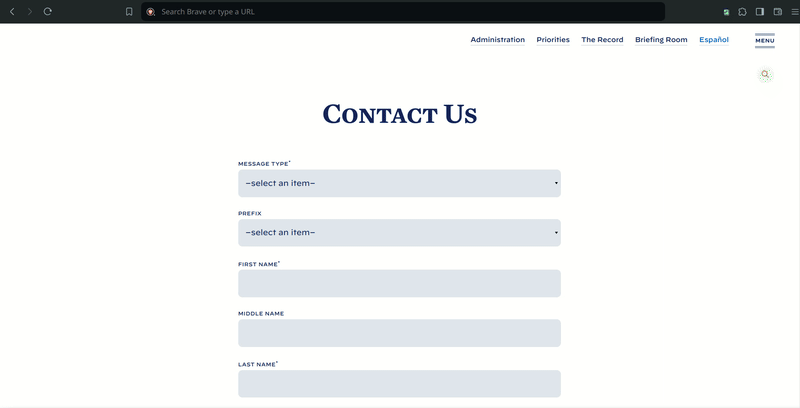

# EasyTest Form Filler

EasyTest Form Filler is a chrome extension that fills form on webpage automatically with random data and help developers and testers save time.

## How it works?

* Simply install the extension by following instructions given below.
* Go to the webpage you want to fill the form with random data.
* Click on extension and hit "GO!".

It's that simple, with just one click it will fill all the fields present on webpage.

---

## Installation

1. Download zip file of this repository and extract it on your machine.
2. Go to extension page on your chromium based browser (Google Chrome, Brave, Edge etc.).
    - or paste this url depending on the browser you're using:
      - For Chrome `chrome://extensions/`
      - For Brave `brave://extensions/`
      - For Edge `edge://extensions/`
3. Turn on __Developer mode__ present on top right corner of the extension page.
4. Click on __Load unpacked__ and navigate to the folder where you have extracted files for this extension.
5. Then click select folder.

Your Extension is now installed and is ready to use.
